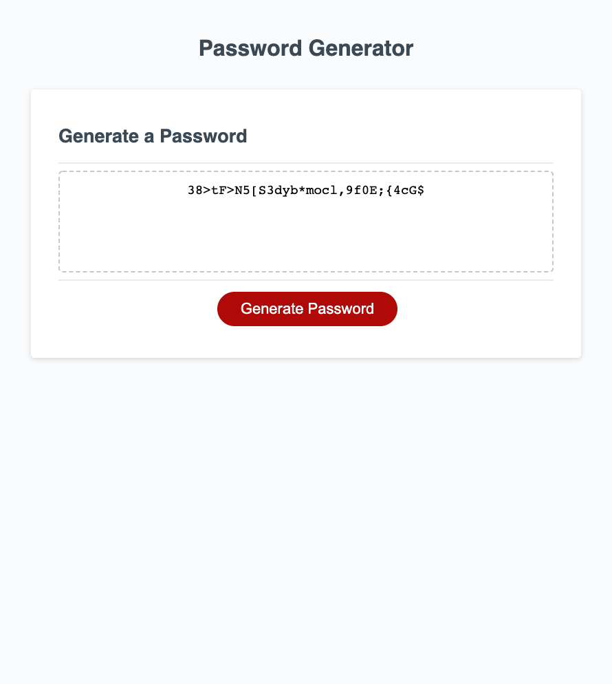

# probable-palm-tree

Assignment: Password-Generator

Developer: Mehdi Mehrabani

For this week, we were tasked with coding the logic behind a randomly generated password. The significance of this task should not be understated since a password is usually the first line of defense against someone trying to get into a computer system.

While I was researching the importance of a strong password I came across a website that displayed the most common passwords for the year 2020. One of the categories alongside the passwords, was the time it took hackers to crack the password. This to me was what stuck out the most.

See below the top 10 most common passwords & the time it took to crack each one:

1.  123456 | less than a second
2.  123456789 | less than a second
3.  picture1 | 3 hours
4.  password | less than a second
5.  12345678 | less than a second
6.  111111 | less than a second
7.  123123 | less than a second
8.  12345 | less than a second
9.  1234567890 | less than a second
10. senha | less than a second

If you are interested in the full list, check out the link [Top 200 most common passwords of the year 2020](https://nordpass.com/most-common-passwords-list/)

Scanning the list myself, what I found extremely interesting was for password #148 = x4ivygA51F. There were 18,267 users that had the same password. To me it seems like a randomly generated password, but I’m not sure that’s the case if 18,267 people also have the same one.

For this reason, I now have a little more appreciation for the criteria’s this assignment had us follow in order to generate a secure password.

## ASSIGNMENT SUMMARY

We were given a starter code, and it was our job to write the logic that went into a randomly generated password. The requirements to completing this assignment were the following.

When a user clicks on the “Generate Password”:

[A] A series of prompt boxes will appear asking user a series of questions.

1.  Length of Password:

    a. Prompt Box #1: Type the length of password. A number between 8 to 128 characters

2.  Special Characters

    a. Confirm Box #2: Whether user wants password to include lowercase letters?
    b. Confirm Box #3: Whether user wants password to include uppercase letters
    c. Confirm Box #4: Whether user wants password to include numbers?
    d. Confirm Box #5: Whether user wants password to include symbols.?

[B] Rules to follow:

1. Length of password has to be between 8 to 128 characters long

2. At least 1 special character must be selected

## STEPS TAKEN TO WRITE CODE

[A] Gather list of Special Character that will be used to generate the final password.

1.  Numbers – 0,1,2,3,4,5,6,7,8,9
2.  Lowercase letters – a, b, c, d, e, f, g, h, i, j, k, l, m, n, o, p, q, r, s, t, u, v, w, x, y, z
3.  Uppercase letters – A, B, C, D, E, F, G, H, I, J, K, L, M, N, O, P, Q, R, S, T, U, V, W, X, Y, Z
4.  Special Characters - !"#$%&()\*+,-./:;<=>?@[]^\_`{|}~

[B] Begin writing function for randomly selecting a character from each list.

1.  One of the best resources I came across was the following link from w3schools. Check out link [JavaScript Random](https://www.w3schools.com/js/js_random.asp)
    a. Random Function - Math.floor(Math.random()

    - Math.random() – generates a number between 0 and 1.
    - Math.floor() – rounds down to the nearest integer.
    - When used together, we can generate a random integer.

    b. Putting all of this together, I was able to create a function for each list to select a random character each time it’s run.

[C] Writing the code for Prompt + Confirm boxes & Checks & Final Random Password

1. When user is asked for the length of the password, they type a number.
   a. Prompt Box - It’s important to note that this value will return as a string, but JavaScript inherently will convert the string to a number for comparison purposes used in the check.

   b. For the check, I wrote an if statement. If the user types a number less than 8 or greater than 128, an alert box will appear providing them with a message stating the rules. For the sake of having a little fun, I wrote two separate messages. Could have used the `||` to keep it clean, but I like the unique messages.

2. Once the password meets the 8 to 128 character, user will be presented with 4 sequential confirm boxes answering whether they want to include lowercase letters, uppercase letters, numbers, and symbols.

   a. Prompt Box vs. Confirm Box

   - Prompt Box – Allows users to enter text which will return as a string.

   - Confirm Box – Allowes users to click on button Ok or Cancel. The answers return as boolean [true or false].

3. Logic behind Special Character Prompt Section

   a. Master Character List – Since user has a choice of excluding one of the character types for the final password, I knew I had to create a master character list.

   - Create a variable to house the unique list for final password pull.

   - Use an if statement to check if user wants to include or not.

     i. If include – run the random function and add to the master character list

     ii. If include, make sure to reserve one randomly selected spot in the final password string for each confirmed character type. To achieve this, I created a passwordConfirmPage variable to house these characters. The length will reduced when the final loop occurs.

     iii. If not – push false to tracker. Tracker is an array just so the check at the end is comparing against value 4 and not 20. For more information, see section below called “Learning Points”.

4. Finally, after all the checks confirmed good, I created the loop to randomly selecting characters from the master list based on a length inputed less the saved characters from each confirmed character type.

## Other Key Learning Points: When to use Array.push() & when to use Addition Assignment +=

[A]. `var password = '';` The password will be presented as a string. If this was created as an array, each time we add a new character, it will be added as a new element. Therefore, we would have to use additional functions to join the elements into one single piece at the end once all random characters have been added.

- String | var password = string | '123456789'

- Array | var password = array | [“1”,”2”,”3”,”4”,”5”,”6”,”7”,”8”,”9”]

[B] `var trackerConfirm = [];` I only wanted to compare if the confirm box was Canceled 4 times. Therefore, knowing that the array.length will be = 4. If I used the string method & +=, I would have to compare the check to 20 characters.

- String | var trackerConfirm = string | 'falsefalsefalsefalse' | 20 Characters

- Array | var trackerConfirm = array | [false,false,false,false] | 4 Elements

## Image Of Final Assignment

